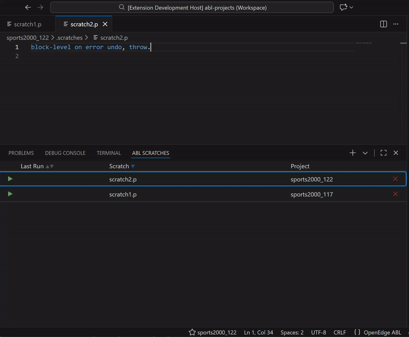
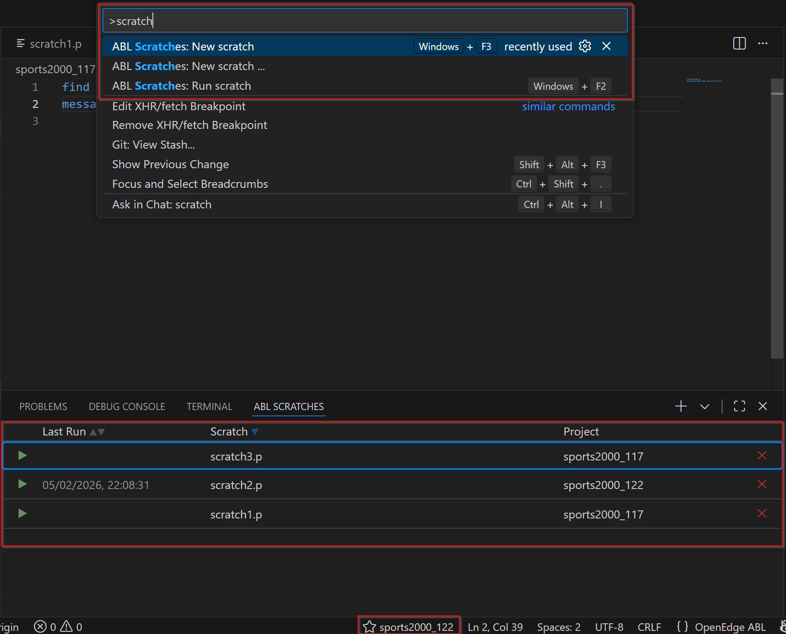

# ABL Scratch Playground

A VS Code extension for writing ABL scratch files (a.k.a. Scratchpad / ABL Dojo).

## Related Software
This extension depends on the [OpenEdge ABL](https://marketplace.visualstudio.com/items?itemName=RiversideSoftware.openedge-abl-lsp) extension by [Riverside Software](https://marketplace.visualstudio.com/publishers/RiversideSoftware).

## Description
It lets you quickly create and run short Progress OpenEdge ABL sratch snippets.

The ABL Scratches view, which is automatically opened after installation, detects the OpenEdge projects in your workspace and allows each scratch to run in the context of a selected project.

To add a new scratch, use the action **New scratch** or click the **+** button. When the workspace has multiple OpenEdge projects, a drop-down is shown where you can pick the target OpenEdge project.

Scratch files are stored **inside** your project in the `.scratches` folder. When creating a scratch for the first time, you will be prompted to include `.scratches` to your `.gitignore` file (if the project uses Git).

## ABL Scratches view
The ABL Scratches view allows you to manage your scratch files. From this view you can create, open, run and delete scratches.
For each scratch, the last run timestamp is displayed in the list.

### Actions
- **New scratch**
  Creates a new scratch file and opens it in the editor
  Default keybinding: `Win+F3` (or `Cmd+F3` for macOS)
  _(Also available via the Command Palette, context menu of the Explorer and Status Bar when a default OpenEdge project is set)_
- **Run Scratch**
  Executes the selected scratch in the context of its assigned project
  Default keybinding: `Win+F2` (or `Cmd+F2` for macOS)
  _(Also available via the Command Palette)_
- **Delete Scratch**
  Removes the selected scratch and automatically closes the editor tab if it is currently open
- **Open Scratch**
  Double-click (or right-click) to open the scratch file in the editor

## Screenshot

## Settings

### User only
- **Enable debug logging**
  Enables debug-level logging for this extension.
  Defaults to `false`.

## Support
Please report issues and feature requests via the GitHub repository.

## Related Extensions
You may also be interested in my other extension: [ABL DataDigger Launcher](https://marketplace.visualstudio.com/items?itemName=vdende.abl-datadigger-launcher).

## Licensing and Legal Notices
- This extension is licensed under the [MIT License](LICENSE).
- OpenEdge and ABL are registered trademarks of Progress Software Corporation.
